# Foco OS — Meu Sistema Operacional Pessoal

> Projeto da disciplina **Produtividade e Gestão do Tempo** (UniFECAF)
> Tema: *Utilizando IA para Gerenciar Tempo, Comunicação e Produtividade*

O **Foco OS** é um Sistema Operacional Pessoal (Personal Operating System – POS) que organiza tarefas, compromissos e hábitos combinando a **Matriz de Eisenhower**, a **Técnica Pomodoro** e a **captura do método GTD** com ferramentas digitais e Inteligência Artificial.

Na prática, basta enviar uma mensagem como *"entregar relatório amanhã"* para um bot no Telegram: a IA classifica a tarefa, define prazo e etiqueta, e cria o card na lista certa do Trello. Todas as manhãs, um briefing gerado por IA chega no Telegram com as prioridades do dia encaixadas entre os compromissos da agenda. Um painel web acompanha tudo, com matriz, visão semanal, timer Pomodoro e métricas de produtividade.

🔗 **Demonstração:** https://foco-os--sgorlonribeiro.replit.app *(acesso protegido por senha, enviada junto com a entrega)*

---

## Sumário

1. [Problema](#1-problema)
2. [Ferramentas utilizadas](#2-ferramentas-utilizadas)
3. [Arquitetura e fluxo de organização](#3-arquitetura-e-fluxo-de-organização)
4. [Funcionalidades](#4-funcionalidades)
5. [Prints](#5-prints)
6. [Como utilizar a solução](#6-como-utilizar-a-solução)
7. [API do Foco OS](#7-api-do-foco-os)
8. [Estrutura do repositório](#8-estrutura-do-repositório)
9. [Segurança](#9-segurança)

---

## 1. Problema

Minha rotina combina trabalho presencial com escala de plantão, faculdade e treinos. As tarefas ficavam espalhadas entre grupos de WhatsApp e a memória, sem critério de prioridade. O resultado era procrastinação, tempo de tela improdutivo e tarefas concentradas na última hora, agravadas pelo cansaço dos plantões.

O Foco OS ataca cada um desses pontos:

| Desafio | Resposta do sistema |
| --- | --- |
| Tarefas espalhadas e esquecidas | Captura imediata pelo Telegram, com destino único no Trello |
| Falta de critério para priorizar | Classificação automática pela Matriz de Eisenhower |
| Procrastinação ("por onde começo?") | Briefing diário com a ordem sugerida das tarefas |
| Distração com redes sociais | Blocos Pomodoro com pausas planejadas |
| Cansaço e estresse | Termômetro de carga e limite diário de Pomodoros |

---

## 2. Ferramentas utilizadas

| Ferramenta | Papel no sistema |
| --- | --- |
| **Trello** | Base das tarefas. Cada lista representa uma etapa ou quadrante: `Entrada`, `Q1 - Fazer agora`, `Q2 - Agendar`, `Q3 - Delegar`, `Q4 - Eliminar` e `Concluído`. Etiquetas: Trabalho, Faculdade, Pessoal e Saúde. |
| **Replit** | Hospedagem do **Foco OS**, o painel web (React + Vite + Tailwind no frontend, Node.js + Express no backend, PostgreSQL para as sessões de Pomodoro). |
| **Make.com** | Automação que conecta todas as ferramentas, em dois cenários. |
| **Telegram** | Canal de entrada de tarefas e de recebimento do briefing, por meio de um bot próprio. |
| **Google Agenda** | Compromissos com horário (aulas, treinos, reuniões), usados no briefing. |
| **Google Gemini** | IA que classifica as tarefas e redige o briefing diário. |

---

## 3. Arquitetura e fluxo de organização

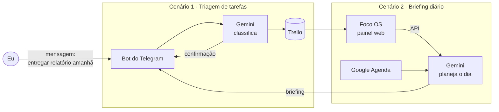

### Cenário 1 — Triagem automática (Telegram → IA → Trello)

`Telegram (Watch Updates)` → `Filtro` → `Gemini` → `Parse JSON` → `Set variables` → `Trello (Create a Card)` → `Telegram (Send Message)`

1. Envio uma mensagem curta ao bot descrevendo a tarefa.
2. Um filtro aceita apenas mensagens do meu chat e ignora comandos (`/start`).
3. O Gemini recebe a mensagem e a data atual e devolve um JSON com **título, descrição, quadrante, etiqueta, vencimento e justificativa**. Datas relativas ("amanhã", "sexta") são convertidas em datas reais.
4. O Make escolhe a lista e a etiqueta do Trello a partir da resposta. Qualquer resposta inesperada vai para a **Entrada**, para revisão manual.
5. O card é criado e o bot responde com um resumo e a justificativa da classificação.

### Cenário 2 — Briefing diário (Foco OS + Agenda → IA → Telegram)

`HTTP (GET /api/resumo-diario)` → `Google Calendar (Search Events)` → `Text aggregator` → `Gemini` → `Telegram (Send Message)`

1. Agendado para **dias úteis às 7h** (desativado fora do período de demonstração, sendo executado pelo *Run once*).
2. Busca no Foco OS as prioridades, as tarefas atrasadas e o termômetro de carga.
3. Busca no Google Agenda os compromissos das próximas 24 horas.
4. O Gemini gera um plano do dia com a ordem sugerida das tarefas em blocos de Pomodoro, respeitando os compromissos e os prazos.
5. O briefing chega no Telegram.

### Rotina de uso

| Momento | Ação |
| --- | --- |
| Manhã | Leio o briefing no Telegram e abro a tela **Hoje** do Foco OS. |
| Durante o dia | Novas demandas vão direto para o bot, sem interromper o que estou fazendo. |
| Blocos de foco | Uso o **Pomodoro** vinculado a um card. |
| Fim do dia | Arrasto os cards concluídos e faço a triagem da **Entrada** na Matriz. |
| Semana | Reviso a tela **Semana** e as **Métricas**, priorizando avanços no Q2. |

---

## 4. Funcionalidades

**Foco OS (painel web)**

- **Hoje:** prioridades do dia, tarefas atrasadas, caixa de entrada e termômetro de carga.
- **Matriz:** Matriz de Eisenhower com arrastar e soltar, que atualiza o Trello em tempo real.
- **Semana:** tarefas distribuídas pelos dias, destacando compromissos e dias sobrecarregados.
- **Pomodoro:** timer 25/5/15 vinculado a um card, com sugestões de pausa e limite diário.
- **Métricas:** tarefas concluídas, horas de foco, distribuição por quadrante e por etiqueta, com exportação em CSV.
- **Configurações:** durações do Pomodoro, limites de carga e status da conexão com o Trello.
- Tema escuro e claro, layout responsivo e acesso protegido por senha.

**Uso de IA**

- Classificação de tarefas pela Matriz de Eisenhower, com justificativa.
- Interpretação de datas em linguagem natural.
- Geração do plano diário a partir de tarefas e compromissos reais, com a instrução de nunca inventar informações.

---

## 5. Prints

### Foco OS

| Tela Hoje | Matriz de Eisenhower |
| --- | --- |
| 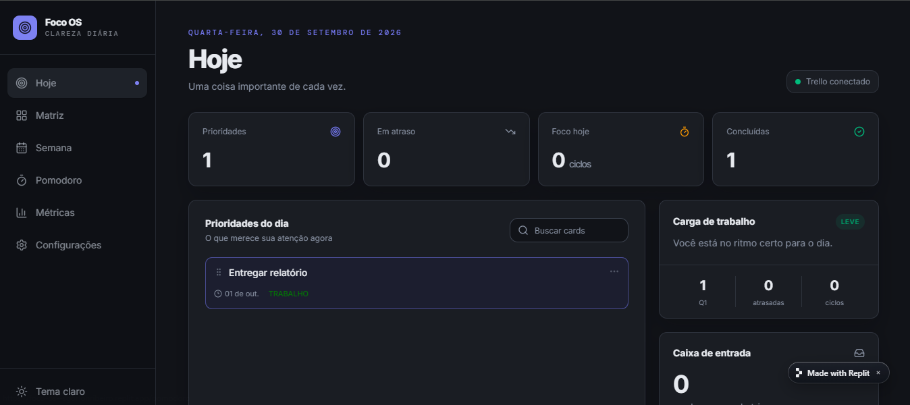 | 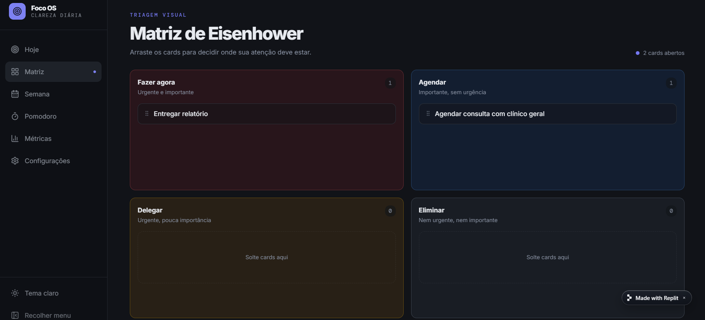 |

| Semana | Pomodoro |
| --- | --- |
| 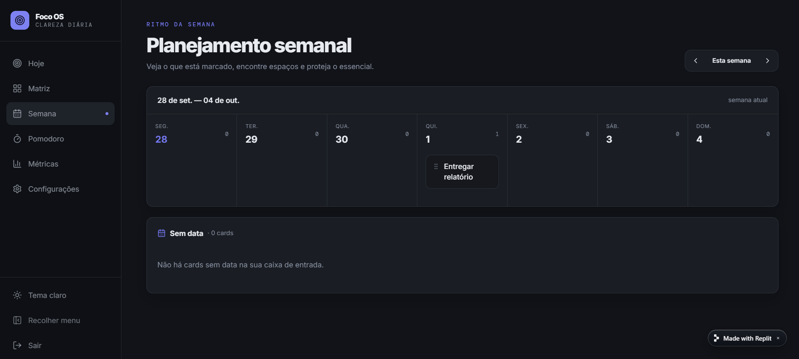 | 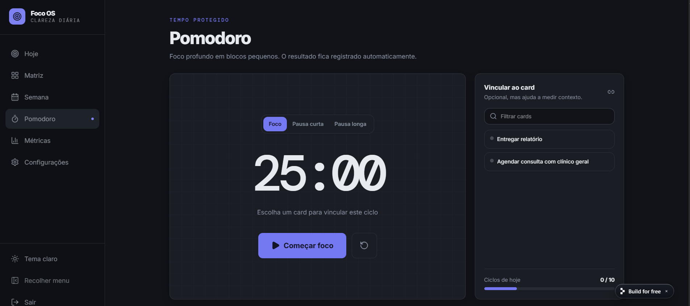 |

| Métricas | Tela de acesso |
| --- | --- |
| 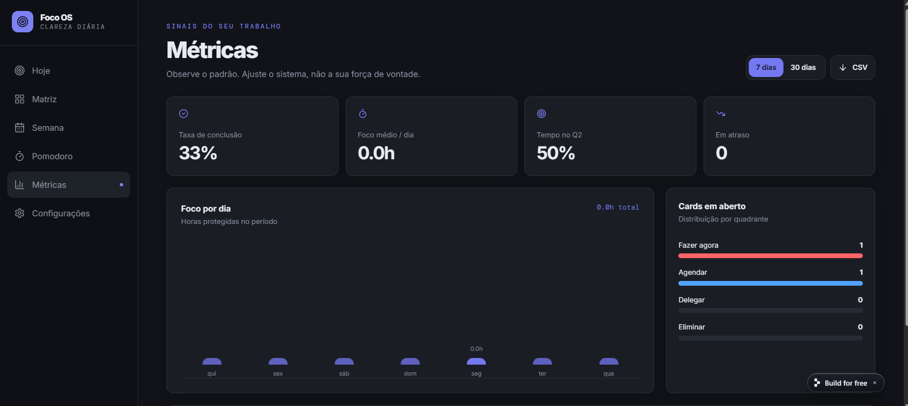 | 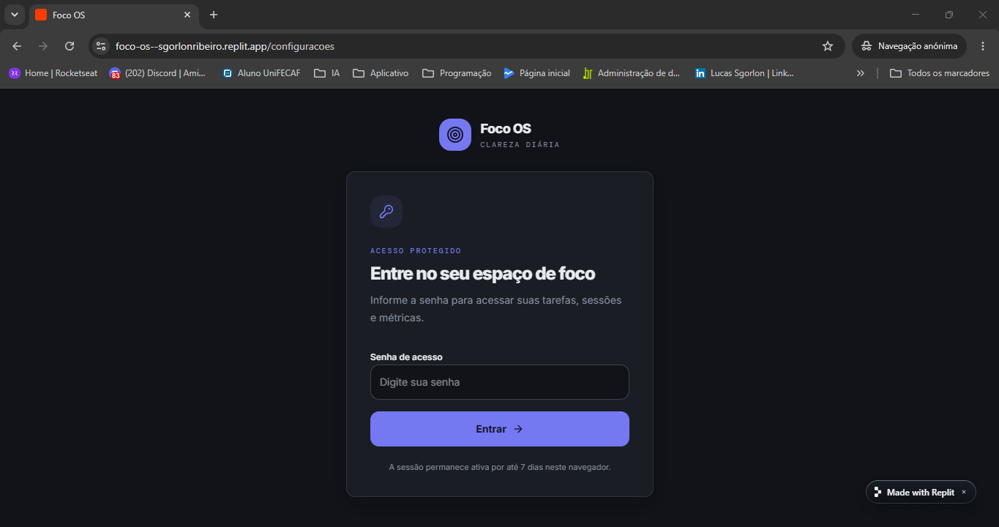 |

### Trello

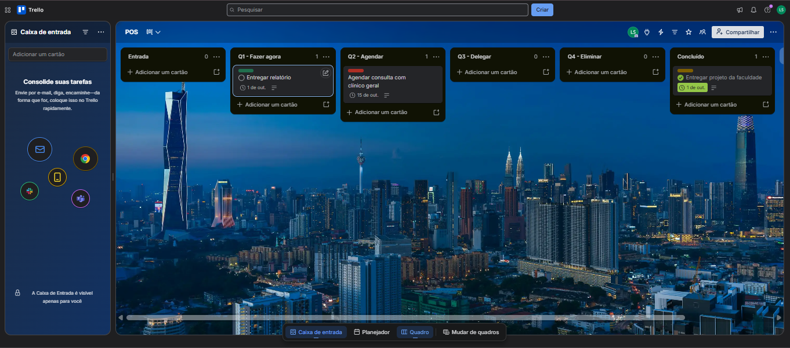

### Make.com

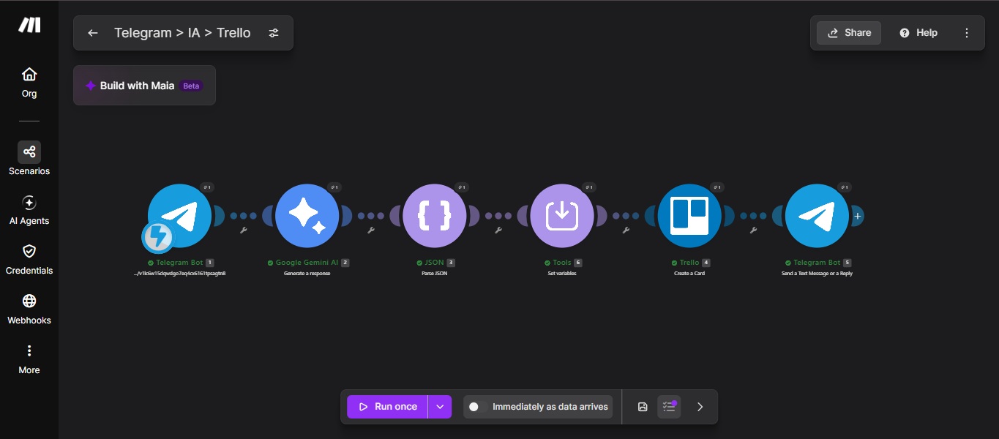

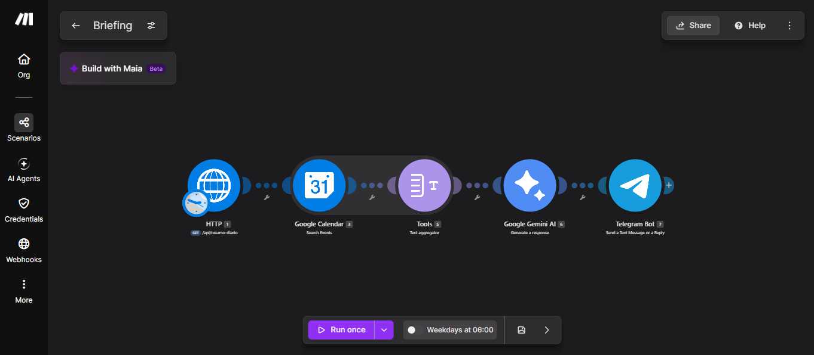

### Telegram

| Criação de card | Briefing diário |
| --- | --- |
| 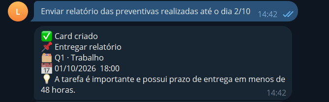 | 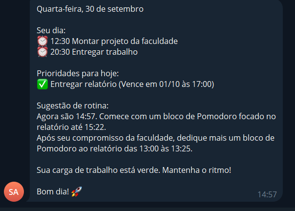 |

---

## 6. Como utilizar a solução

### Uso no dia a dia

1. **Registrar uma tarefa:** envie uma mensagem ao bot do Telegram, por exemplo *"prova de redes quinta"* ou *"marcar dentista mês que vem"*. O card aparece no Trello e no Foco OS em segundos.
2. **Planejar o dia:** leia o briefing da manhã e abra a tela **Hoje**.
3. **Executar:** abra o **Pomodoro**, vincule o card e siga os blocos de foco.
4. **Reorganizar:** arraste cards entre quadrantes na **Matriz**; a mudança é refletida no Trello.
5. **Acompanhar:** consulte as **Métricas** semanalmente.

### Como reproduzir o projeto

**1. Trello**

- Crie um quadro com as listas `Entrada`, `Q1 - Fazer agora`, `Q2 - Agendar`, `Q3 - Delegar`, `Q4 - Eliminar` e `Concluído`, e as etiquetas Trabalho, Faculdade, Pessoal e Saúde.
- Em [trello.com/power-ups/admin](https://trello.com/power-ups/admin), crie um aplicativo (sem recursos de Power-up) e gere a **API Key** e o **Token**.

**2. Foco OS no Replit**

- Importe este repositório no Replit.
- Configure os Secrets:

| Secret | Descrição |
| --- | --- |
| `TRELLO_API_KEY` | Chave de API do Trello |
| `TRELLO_TOKEN` | Token de acesso do Trello |
| `TRELLO_BOARD_ID` | Código do quadro (trecho da URL `trello.com/b/<ID>/...`) |
| `POS_API_KEY` | Chave criada por você para proteger a API (`openssl rand -hex 32`) |
| `APP_PASSWORD` | Senha de acesso ao painel |
| `SESSION_SECRET` | Segredo das sessões de login |

- Sem as credenciais do Trello, o app funciona em **modo demonstração** com dados fictícios.
- Publique o app com acesso **Público** (a proteção fica na senha do app e no `x-api-key` da API).

**3. Bot do Telegram**

- No Telegram, envie `/newbot` ao **@BotFather** e guarde o token do bot.

**4. Cenários no Make.com**

- Em *Create a new scenario* → *Import blueprint*, importe os arquivos da pasta [`make/`](make/).
- Refaça as conexões: Telegram (token do bot), Google Gemini (chave do Google AI Studio), Trello e Google Agenda.
- No **Cenário 1**, atualize o filtro com o seu Chat ID e o módulo *Set variables* com os IDs das suas listas e etiquetas, obtidos em:
  `https://api.trello.com/1/boards/<BOARD_ID>/lists?key=<API_KEY>&token=<TOKEN>` (e `/labels` para as etiquetas).
- No **Cenário 2**, atualize a URL do módulo HTTP, o header `x-api-key` e o Chat ID do Telegram.

> **Dica:** no Make, digite as fórmulas e selecione os itens pelo painel de mapeamento. Colar fórmulas prontas pode converter textos em operadores ou referências inválidas.

---

## 7. API do Foco OS

Todas as rotas exigem o header `x-api-key` com o valor de `POS_API_KEY`.

| Método | Rota | Retorno |
| --- | --- | --- |
| `GET` | `/api/resumo-diario` | Prioridades do dia, atrasadas, itens na Entrada, Pomodoros e concluídas do dia anterior, termômetro de carga |
| `GET` | `/api/resumo-semanal` | Concluídas na semana, horas de foco, distribuição por quadrante e etiqueta, previsão da próxima semana |
| `POST` | `/api/pomodoro` | Registra uma sessão de Pomodoro externa |
| `GET` | `/api/health` | Status da aplicação e da conexão com o Trello |

Os horários são retornados em UTC; o fuso de referência do sistema é `America/Campo_Grande` (UTC−04:00).

---

## 8. Estrutura do repositório

```
├── README.md
├── docs/
│   └── prints/          # capturas de tela usadas neste README
├── make/
│   ├── cenario-1-triagem.blueprint.json
│   └── cenario-2-briefing.blueprint.json
└── ...                  # código do Foco OS (frontend e backend)
```

---

## 9. Segurança

- Nenhuma credencial é armazenada no código; todas ficam nos Secrets do Replit.
- O painel exige senha, e a API exige o header `x-api-key`.
- O bot do Telegram só processa mensagens do chat do autor.
- Os blueprints exportados do Make não contêm os tokens das conexões, que precisam ser refeitas ao importar. O valor do header `x-api-key` foi removido do blueprint do Cenário 2 antes da publicação.

---

**Autor:** Lucas Sgorlon Ribeiro · UniFECAF · 2026
